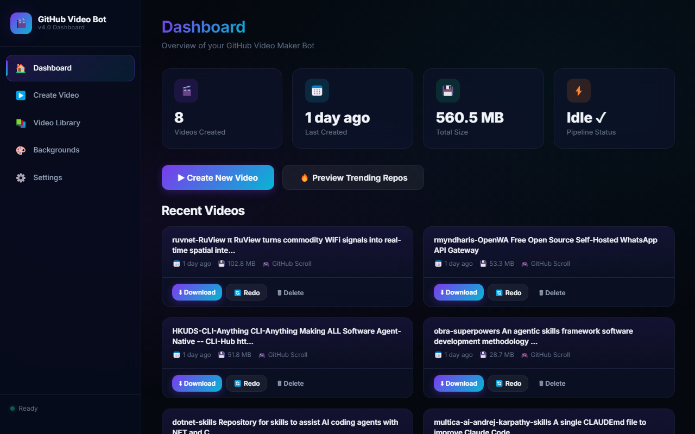
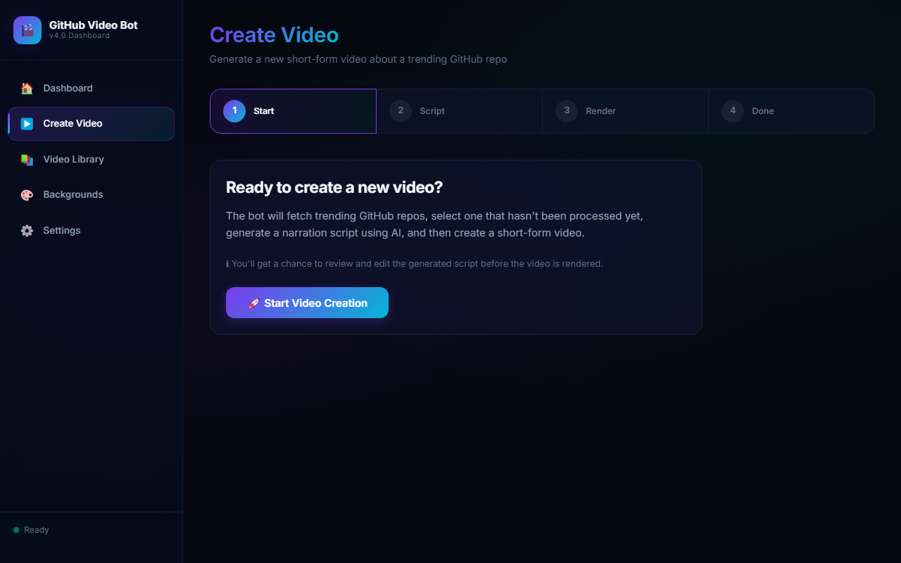
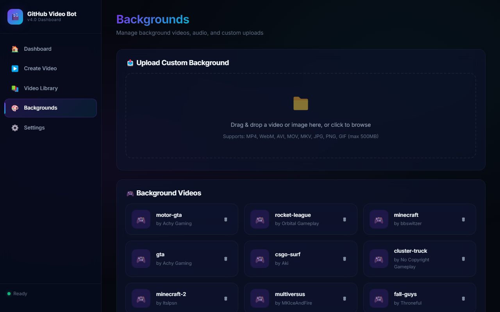
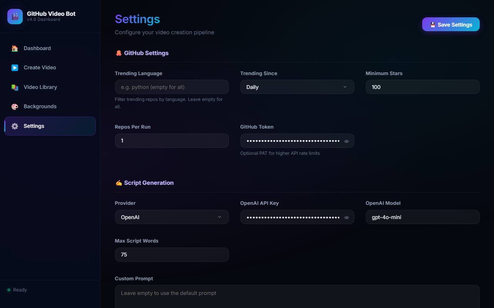

# GitHub Video Maker Bot 🚀

Scrapes the trending repositories on GitHub and Automatically create engaging, short-form videos (for TikTok, YouTube Shorts, or Instagram Reels) showcasing trending GitHub repositories!

All done WITHOUT manual video editing or asset compiling. Just pure ✨programming magic✨.

## New Interactive Dashboard! 🎨

We've introduced a beautiful, modern **Web Dashboard** to easily manage and create videos!



From the dashboard you can:
- **Create Videos:** Kick off a video generation pipeline.
- **Review & Edit Scripts:** Pause the pipeline to review and edit the generated script before it's narrated.
- **Manage Backgrounds:** Upload custom background images and videos, or use YouTube links.
- **View History:** See your previously generated videos, re-download them, or view their scripts.
- **Live Logs:** Watch the video generation process in real-time.




## How it Works 🤔

This bot automatically:
1. Scrapes the **trending repositories** on GitHub.
2. Uses **OpenAI** (or a fallback method) to generate a catchy, concise narration script about the repository.
3. Uses **Text-to-Speech (TTS)** (including a 100% local **VoxCPM** model or OpenAI) to read the generated script.
4. Uses **Playwright** to navigate to the repository and capture screenshots of the README.
5. Merges everything together with the TTS voiceover, custom backgrounds, and chill background music.

The result? A ready-to-upload, high-quality, short-form video that highlights cool open-source projects!

## Requirements

- Python 3.10+
- Playwright (installed automatically via the installation steps)

## Installation 👩‍💻

1. **Clone this repository:**
    ```sh
    git clone https://github.com/elebumm/GithubVideoMakerBot.git
    cd GithubVideoMakerBot
    ```

2. **Create and activate a virtual environment:**
    - On **Windows**:
        ```sh
        python -m venv ./venv
        .\venv\Scripts\activate
        ```
    - On **macOS and Linux**:
        ```sh
        python3 -m venv ./venv
        source ./venv/bin/activate
        ```

3. **Install the required dependencies:**
    ```sh
    pip install -r requirements.txt
    ```

4. **Install Playwright and its dependencies:**
    ```sh
    python -m playwright install
    python -m playwright install-deps
    ```

5. **Start the Web Dashboard:**
    ```sh
    python GUI.py
    ```
    Then open your browser and navigate to `http://localhost:4000/`.

6. **Configuration:**
    - You can configure the bot directly from the Web Dashboard's Settings page, or edit `config.toml`.
    - If you want to use OpenAI for high-quality TTS or script generation, you will need to provide an **OpenAI API Key**.
    - If you don't have an OpenAI key, you can use the completely local **VoxCPM** TTS engine!

(Note: If you encounter any errors installing or running the bot, try using `python3` or `pip3` instead of `python` or `pip`.)



## Output

Videos are rendered and saved in the `results/github/` directory. The bot keeps track of repositories it has already processed so it won't create duplicate videos. You can also view and download all of them directly from the History tab in the dashboard.

## Contributing & Ways to improve 📈

In its current state, this bot does exactly what it needs to do. However, improvements can always be made!

- Feel free to submit pull requests or issues.
- Please read our [contributing guidelines](CONTRIBUTING.md) for more detailed information.

## LICENSE
[Roboto Fonts](https://fonts.google.com/specimen/Roboto/about) are licensed under [Apache License V2](https://www.apache.org/licenses/LICENSE-2.0).
This project was initially forked and modified from the Reddit Video Maker Bot project.
